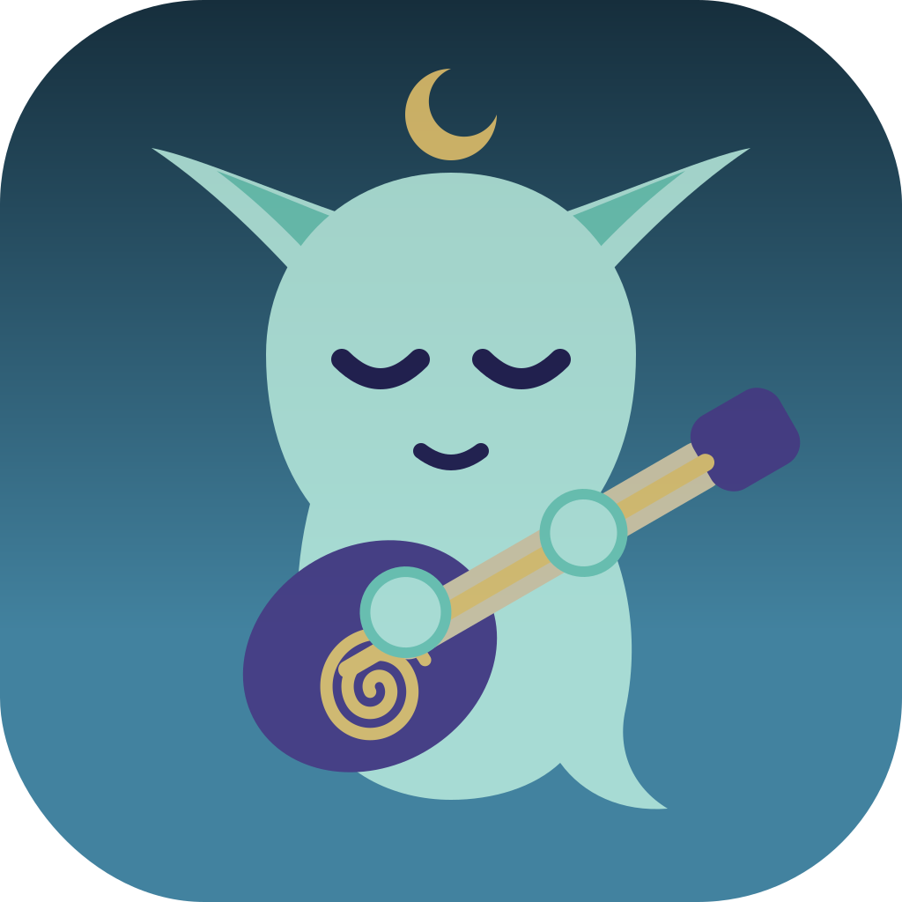

<p align="center">
  
</p>

# Bòcan Music for Android

**Your Mac's music library, in your pocket, on your terms.** Bòcan for Android is the native companion to [Bòcan Music](https://github.com/bocan/bocan-music), the macOS player for people who still own their music. Pair with your Mac once, using a code it shows you, and from then on your library simply follows you: whenever your phone and your Mac see each other on your Wi-Fi, everything new flows down over pinned, mutually authenticated TLS. No cloud between them. No account. No subscription. No telemetry. Your FLAC rips, your DSD experiments, your dustiest MP3s, your podcasts, your playlists, all played properly: gapless, loudness-corrected, EQ'd, with synced lyrics scrolling by. The Mac curates; the phone plays. Nothing on the phone can edit, tag, or delete a single file, because a music player should play music.

## What it does

### Sync, the Bòcan way

- **Pair once with a code.** The Mac displays six digits; you type them on the phone. The code is derived from both devices' TLS certificate fingerprints, so a mismatch doesn't mean a typo, it means someone is interfering with your network. Everything after pairing runs over mutual TLS with both certificates pinned.
- **One-way, Mac to phone.** The Mac is the source of truth. The phone diffs a manifest, downloads what changed with resume support, verifies every file by SHA-256, and removes what left the sync set. Pull the plug mid-sync and nothing corrupts; it just converges next time.
- **Automatic and invisible.** Discovery over mDNS/Bonjour; syncs trigger when the paired Mac appears on the network, with Wi-Fi-only and charging-only controls. Choose on the Mac what syncs: everything, or selected playlists, with podcasts on or off.
- **Yours stays yours.** Play counts, listening positions, and scrobble queues live in phone-local tables that sync never touches.

### A real player

- **Gapless playback** and wide format support: FLAC, ALAC, MP3, AAC, Opus, Vorbis, and via a bundled FFmpeg decoder the exotic stuff too: APE, WavPack, Musepack, DSD, TTA, and friends.
- **ReplayGain** (track and album modes, with preamp and peak-aware clipping protection) using the values your Mac already analysed.
- **10-band graphic EQ** with the same bands and presets as the Mac app, plus bass boost, a protective limiter, skip silence, and end-of-track fades.
- **Synced lyrics**, karaoke-style, fetched from your Mac and cached; tap a line to seek.
- **Playlists and smart playlists**: smart rules are evaluated on the Mac and delivered as ready-made lists, folders, accent colours and all.
- **Queue done right**: Up Next, play next, repeat modes, Fisher-Yates shuffle or Smart Shuffle weighted by your skip history, and a queue that survives the app being killed.
- **CUE sheet virtual tracks**, ratings and loved flags (displayed, never edited), full-text search across everything, and a sleep timer that fades out instead of cutting.

### Podcasts

Episodes your Mac downloaded, ready offline: per-episode resume (seeded from the Mac the first time, then the phone owns its own progress), per-show playback speed, skip intervals, Podcasting 2.0 chapters with tap-to-seek, a continue-listening shelf, unplayed badges, and safely rendered show notes.

### A good Android citizen

- **Android Auto** with a full browsable library.
- **Home-screen widget**, rich media notification, lock-screen controls, and correct Bluetooth/AVRCP metadata on car head units.
- **Material You** dynamic theming with a Bòcan brand fallback, light and dark, OLED pure-black option, TalkBack accessibility throughout.
- **Scrobbling** to Last.fm, ListenBrainz, and Rocksky with an offline-resilient queue, strictly opt-in.

### What it will never do

Edit tags. Modify playlists. Delete or alter your files. Sync anything back to the Mac. Talk to a cloud. Phone home.

## Status

Pre-implementation: this repository currently holds the complete design specification, being built phase by phase. Follow along; the commit history is the build diary.

## The methodology

This app is being built the same way the Mac app was: **spec first, then code, one phase per session.** The entire design lives in [`docs/design-spec/`](docs/design-spec/), written so that any capable coding model (or human) can pick up a single phase file cold and implement it, with contracts as verbatim requirements, test plans with specific cases, and acceptance checkboxes as the merge gate.

The binding documents:

- [`docs/design-spec/README.md`](docs/design-spec/README.md): the index, the workflow, and a Mac-to-Android feature parity map
- [`docs/design-spec/_standards.md`](docs/design-spec/_standards.md): the engineering charter every phase obeys
- [`docs/design-spec/sync-protocol.md`](docs/design-spec/sync-protocol.md): the Bòcan Sync Protocol v1 wire contract, shared verbatim with the Mac repo and kept honest by golden test fixtures that must stay byte-identical in both codebases

The phases:

| Phase | Scope |
|-------|-------|
| [00 Foundations](docs/design-spec/phase-00-foundations.md) | Gradle modules, CI, lint, logging, theming, the adaptive app icon |
| [01 Persistence](docs/design-spec/phase-01-persistence.md) | Room schema mirroring the manifest, phone-local state tables, FTS search |
| [02 Discovery and Pairing](docs/design-spec/phase-02-discovery-pairing.md) | mDNS discovery, device identity, the pairing ceremony, pinned trust |
| [03 Sync Engine](docs/design-spec/phase-03-sync-engine.md) | Manifest diffing, resumable verified downloads, auto-sync, status UI |
| [04 Playback Engine](docs/design-spec/phase-04-playback-engine.md) | Media3 + FFmpeg, gapless, ReplayGain, queue, play stats |
| [05 Library UI](docs/design-spec/phase-05-library-ui.md) | Navigation shell, browsing, search, mini player |
| [06 Now Playing and Queue](docs/design-spec/phase-06-now-playing-queue.md) | The big screen, queue sheet, synced lyrics, sleep timer |
| [07 Podcasts](docs/design-spec/phase-07-podcasts.md) | Resume, speed, chapters, continue listening, show notes |
| [08 EQ and Effects](docs/design-spec/phase-08-eq-effects.md) | 10-band EQ, presets, limiter, fades, skip silence |
| [09 Scrobbling](docs/design-spec/phase-09-scrobbling.md) | Last.fm, ListenBrainz, Rocksky, offline queue |
| [10 System Integration](docs/design-spec/phase-10-system-integration.md) | Android Auto, widget, Bluetooth, notifications |
| [11 Polish](docs/design-spec/phase-11-polish.md) | Settings, onboarding, accessibility and theming audits, localization |
| [12 Release](docs/design-spec/phase-12-release.md) | CI/CD, signing, Play Store and F-Droid readiness |
| [Mac-1 Sync Server](docs/design-spec/phase-mac-1-sync-server.md) | The Mac side, implemented in the bocan-music repo |

Repo-scoped Claude Code skills in [`.claude/skills/`](.claude/skills/) enforce the ritual: a phase runner, a standards review lens, and a protocol contract guard.

## Stack

| Concern | Choice | Why |
|---------|--------|-----|
| Language | Kotlin 2.x, JDK 17+ | The native Android language; Swift-like ergonomics keep the two codebases culturally similar |
| UI | Jetpack Compose, Material 3 | Declarative UI mirroring the Mac app's SwiftUI approach; Material You dynamic color |
| Playback | AndroidX Media3 1.10+ (ExoPlayer, MediaSession) plus the Media3 FFmpeg decoder extension | Gapless, speed/pitch, skip-silence out of the box; FFmpeg covers APE, WavPack, DSD, Musepack and friends, mirroring the Mac's AVFoundation/FFmpeg split |
| Database | Room 3 with FTS5 on the bundled SQLite driver | The Android analogue of the Mac app's GRDB layer; reactive Flows mirror ValueObservation |
| Discovery | `NsdManager` (mDNS / Bonjour) | The Mac advertises `_bocansync._tcp`; both platforms speak Bonjour natively |
| Transport | HTTPS over mutual TLS with pinned self-signed certs, OkHttp client | Pairing binds the two device certificates; everything after is pinned both ways |
| Background sync | WorkManager plus a foreground service for active transfers | Survives Doze; visible progress during large pulls |
| Serialization | kotlinx.serialization | Manifest and protocol JSON |
| Images | Coil 3 | Artwork loading from the synced cache |
| DI | Manual constructor injection via a single `AppGraph` | No Hilt/KSP build fragility; the object graph is small enough to read |

## Architecture at a glance

Strict module DAG, mirroring the Mac app's layering (no upward imports):

```
:core:observability  ->  :core:persistence  ->  :core:sync, :core:playback, :core:scrobble  ->  :app
```

- `:core:observability` owns the `AppLog` facade and redaction.
- `:core:persistence` owns the Room schema, DAOs, and reactive queries.
- `:core:sync` owns discovery, pairing, the trust store, and the manifest-diff sync engine.
- `:core:playback` owns the Media3 player, `MediaLibraryService`, gapless queue, ReplayGain, EQ.
- `:core:scrobble` owns the scrobble providers and offline queue.
- `:app` owns every Compose screen, navigation, widgets, Android Auto surface, and settings.

## Icons

`assets/icons/` contains the Bòcan brand assets from the Mac repo: the layered SVG app icon (moon, spirit, face, and guitar over teal/indigo gradients) and a 1024 px `favicon.svg`. Phase 00 turns these into an Android adaptive icon.

## License

Apache 2.0, same as bocan-music.
